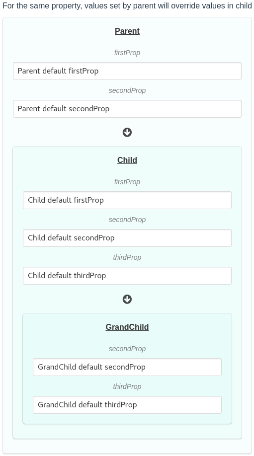

# vue-nested-views

Example of creating three level of views with vue.js

The aim is to enable parent to update the values child, where the values are bound to a v-model and at the same time, making use of props, for the values to be updated from parent.



Based on discussion here:
https://forum.vuejs.org/t/update-data-when-prop-changes-data-derived-from-prop/1517, when a property in a child view changes, and we want the property value to update the data, we need to use a _watcher_.


### Getting Started

```bash
npm install
npm run dev

```

